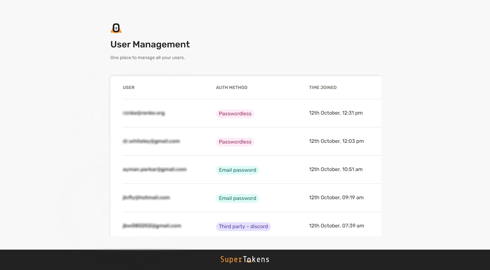

# Open-Source auth provider

Add **secure login and session management** to your apps. [SDKs available](https://supertokens.com/docs/community/sdks)
for popular languages and front-end frameworks e.g. Node.js, Go, Python, React.js, React Native, Vanilla JS, etc.

Supertokens architecture is optimized to add secure authentication for your users without compromising on user and
developer experience

**Three building blocks of SuperTokens architecture**

1. Frontend SDK: Manages session tokens and renders login UI widgets
2. Backend SDK: Provides APIs for sign-up, sign-in, signout, session refreshing, etc. Your Frontend will talk to these
   APIs
3. SuperTokens Core: The HTTP service for the core auth logic and database operations. This service is used by the
   Backend SDK

## Features

* Passwordless Login
* Social Login
* Email Password Login
* Phone Password Login
* Session Management
* Multi-Factor Authentication
* Multi Tenancy / Organization Support (Enterprise SSO)
* User Roles
* Microservice Authentication

## Learn more

- [🚀 What is SuperTokens?](https://github.com/supertokens/supertokens-core#-what-is-supertokens)
    - [Philosophy](https://github.com/supertokens/supertokens-core#philosophy)
    - [Features + Demo app](https://github.com/supertokens/supertokens-core#features---click-here-to-see-the-demo-app)
    - [Documentation](https://github.com/supertokens/supertokens-core#documentation)
- [🏗️ Architecture](https://github.com/supertokens/supertokens-core#%EF%B8%8F-architecture)
- [☕ Why Java?](https://github.com/supertokens/supertokens-core#-why-java)
- [⌨️ User Management Dashboard](https://github.com/supertokens/supertokens-core#-user-management-dashboard)
- [🔥 SuperTokens vs Others](https://github.com/supertokens/supertokens-core#-supertokens-vs-others)
- [🛠️ Building from source](https://github.com/supertokens/supertokens-core#%EF%B8%8F-building-from-source)
- [👥 Community](https://github.com/supertokens/supertokens-core#-community)
    - [Contributors](https://github.com/supertokens/supertokens-core#contributors-across-all-supertokens-repositories)
- [👩‍💻 Contributing](https://github.com/supertokens/supertokens-core#-contributing)
- [📝 License](https://github.com/supertokens/supertokens-core#-license)

### If you like our project, please :star2: this repository! For feedback, feel free to join our [Discord](https://supertokens.io/discord), or create an issue on this repo

## 🚀 What is SuperTokens?

SuperTokens is an open-core alternative to proprietary login providers like Auth0 or AWS Cognito. We are
different because we offer:

- Open source: SuperTokens can be used for free, forever, with no limits on the number of users.
- An on-premises deployment so that you control 100% of your user data, using your own database.
- An end-to-end solution with login, sign-ups, user and session management, without all the complexities of OAuth
  protocols.
- Ease of implementation and higher security.
- Extensibility: Anyone can contribute and make SuperTokens better!

### Philosophy

Authentication directly affects the UX, dev experience, and security of any app. We believe that
current solutions cannot optimize for all three "pillars", leading to many
applications hand-rolling their own auth. This not only leads to security issues but is also a massive
time drain.

We want to change that - we believe the only way is to provide a solution that has the right level of
abstraction gives you maximum control, is secure, and is simple to use - just like if you build it yourself,
from scratch (minus the time to learn, build, and maintain).

We also believe in the principle of least vendor lock-in. Your having full control of your user's data means that you
can switch away from SuperTokens without forcing your existing users to logout, reset their passwords, or in the worst
case, sign up again.

### [Click here](https://thirdpartyemailpassword.demo.supertokens.io/) to see the demo app.

- Please visit [our website](https://supertokens.io/pricing) to see the list of features.
- We want to make features as decoupled as possible. This means you can use SuperTokens for just login, or just session
  management, or both. In fact, we also offer session management integrations with other login providers like Auth0.

### Documentation

The docs can be seen [on our website](https://supertokens.io/docs/community/introduction).

There is more information about SuperTokens on
the [GitHub wiki section](https://github.com/supertokens/supertokens-core/wiki).

## 🏗️ Architecture

Please find an [architecture diagram here](https://supertokens.io/docs/community/architecture)

**For more information, please visit
our [GitHub wiki section](https://github.com/supertokens/supertokens-core/wiki/SuperTokens-Architecture).**

## ☕ Why Java?

- ✅ Whilst running Java can seem difficult, we provide the JDK along with the binary/docker image when distributing it.
  This makes running SuperTokens just like running any other HTTP microservice.
- ✅ Java has a very mature ecosystem. This implies that third-party libraries have been battle-tested.
- ✅ Java's strong type system ensures fewer bugs and easier maintainability. This is especially important when many
  people are expected to work on the same project.
- ✅ Our team is most comfortable with Java and hiring great Java developers is relatively easy as well.
- ✅ One of the biggest criticisms of Java is memory usage. We have three solutions to this:
    - The most frequent auth-related operation is session verification - this happens within the backend SDK (node,
      python, Go) without contacting the Java core. Therefore, a single instance of the core can handle several 10s of
      thousands of users fairly easily.
    - We have carefully chosen our dependencies. For eg: we use an embedded tomcat server instead of a higher-level web
      framework.
    - We also plan on using [GraalVM](https://www.graalvm.org/) in the future and this can reduce memory usage by 95%!
- ✅ If you require any modifications to the auth APIs, those would need to be done on the backend SDK level (for example
  Node, Golang, Python..). So you’d rarely need to directly modify/work with the Java code in this repo.

## ⌨️ User Management Dashboard

Oversee your users with the [SuperTokens User Management Dashboard](https://supertokens.com/docs/userdashboard/about)

### List users

List all the users who have signed up to your application.

### Manage users

Manage users by modifying or deleting their sessions, metadata, roles and account info.

## 🔥 SuperTokens vs others

Please find a detailed comparison chart [on our website](https://supertokens.io/pricing#comparison-chart)

## 🛠️ Building from source

Please see our [wiki](https://github.com/supertokens/supertokens-core/wiki/Building-from-source) for instructions.

## 👥 Community

- [Discord](https://supertokens.io/discord)
- [Email](mailto:team@supertokens.io)

If you think this is a project you could use in the future, please :star2: this repository!

### Contributors (across all SuperTokens repositories)

## 👩‍💻 Contributing

Please see the [CONTRIBUTING.md](https://github.com/supertokens/supertokens-core/blob/master/CONTRIBUTING.md) file for
instructions.

## 📝 License

&copy; 2020-2023 SuperTokens Inc and its contributors. All rights reserved.

Portions of this software are licensed as follows:

* All content that resides under the "ee/" directory of this repository, if that directory exists, is licensed under the
  license defined in "ee/LICENSE.md".
* All third-party components incorporated into the SuperTokens Software are licensed under the original license provided
  by the owner of the applicable component.
* Content outside of the above-mentioned directories or restrictions above is available under the "Apache 2.0"
  license as defined in the level "LICENSE.md" file
